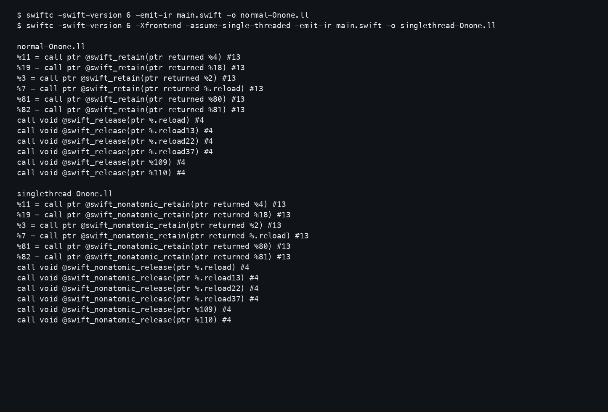

# Swift 6 ARC Atomicity Lab

This repository tests whether Swift 6 concurrency isolation changes which Swift ARC runtime entry points appear in generated code. It separates language-level data-race checking, ARC ownership, and runtime reference-counting implementation.

## Question

Does Swift 6 concurrency isolation change whether compiler-generated ARC uses Swift's atomic or non-atomic runtime entry points?

## Short result

In the tested Apple Swift 6.3.3 cases:

- ordinary compilation emitted `swift_retain` / `swift_release`;
- actor isolation, `Sendable`, and `@unchecked Sendable` did not change that selection;
- compiling the same source with the hidden frontend assumption `-Xfrontend -assume-single-threaded` switched generated calls to `swift_nonatomic_retain` / `swift_nonatomic_release`.

This is compiler/runtime implementation evidence for the tested toolchain. It is not a Swift language guarantee.

## The clean A/B

| Build | Retain | Release |
|---|---|---|
| normal `-Onone` | `swift_retain` | `swift_release` |
| single-threaded `-Onone` | `swift_nonatomic_retain` | `swift_nonatomic_release` |
| normal `-O` | `swift_retain` | `swift_release` |
| single-threaded `-O` | `swift_nonatomic_retain` | `swift_nonatomic_release` |

See [the raw A/B comparison](Evidence/AtomicityAB/DIFF.md).



## What Swift 6 rejects

The negative control is a deliberately illegal non-Sendable mutable reference crossing a concurrency boundary. Its compiler diagnostic is [preserved here](Evidence/Diagnostics/illegal-shared-state.txt); it is not evidence about ARC lowering.

## Compiler path

`frontend option → CompilerInvocation → SILOptions::AssumeSingleThreaded → SILModule::isDefaultAtomic() → IRGen Atomicity → GenHeap runtime call selection`

See [the compiler selection map](Evidence/compiler-rc-selection-map.md) and [the selector source capture](Evidence/Screenshots/03-compiler-atomicity-selector.png).

## Reproduce

```sh
./run-experiment.sh
./run-simulator-validation.sh
```

The first script regenerates compiler output, diagnostics, runtime output, A/B IR/assembly, and the simulator-targeted binary. The second rebuilds with the installed iPhoneSimulator SDK and regenerates raw install/launch evidence on iPhone 17. See [REPRODUCTION.md](REPRODUCTION.md).

## Evidence map

| Area | Evidence |
|---|---|
| Results | [RESULTS.md](RESULTS.md) |
| Reproduction and validation | [REPRODUCTION.md](REPRODUCTION.md), [VALIDATION.md](Evidence/VALIDATION.md) |
| A/B output | [DIFF.md](Evidence/AtomicityAB/DIFF.md) |
| Compiler selection | [compiler-rc-selection-map.md](Evidence/compiler-rc-selection-map.md) |
| Concurrency comparison | [concurrency-vs-arc-selection.md](Evidence/concurrency-vs-arc-selection.md) |
| Runtime | [runtime-source-map.md](Evidence/runtime-source-map.md) |
| Language sources | [language-guarantees.md](Evidence/language-guarantees.md) |
| Claims and visuals | [claim-audit.md](Evidence/claim-audit.md), [screenshot index](Evidence/Screenshots/INDEX.md), [figure](Evidence/Figures/atomicity-selection.svg) |

## Environment

- Apple Swift 6.3.3
- Xcode 26.6
- macOS 26.6.2
- arm64
- Swift language mode 6
- iPhone 17 Simulator for simulator validation

No second official Swift toolchain was installed and tested in this experiment, so cross-toolchain reproduction remains unresolved.

## What this repo does not prove

- Swift ARC is always atomic.
- Actor-isolated objects always use atomic refcounts.
- `Sendable` can never influence ARC optimization.
- Atomic reference counting protects user mutable state.
- `-assume-single-threaded` is a production optimization recommendation.
- The inspected open-source Swift commit is proven to be the exact source revision used to build Apple Swift 6.3.3.
- Behavior in this toolchain is a permanent Swift language rule.

## Status

Research complete. Validation passed. Article pending.
